# Kick the Fly

A kick-the-buddy game where the buddy is a real fruit fly brain: the
**MaleCNS v1.0** connectome ([Google Research blog](https://research.google/blog/a-connectomics-milestone-mapping-the-complete-male-fruit-fly-brain/)),
all 166,700 neurons simulated live while you throw, swat, bomb, burn, dissolve, zap, freeze and feed it to a spider. Or reward it with sugar.

**It's first person:** walk around a 3D living room and use your tools on the fly up close. Walk into it and you kick it. The original 2D version is still there with `--2d`.

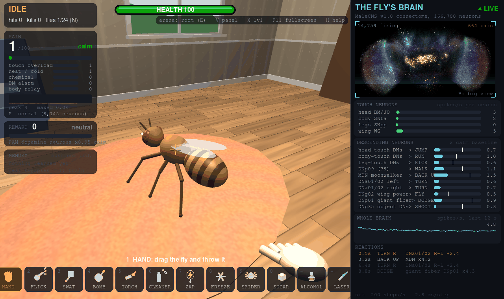

- **Hits fire real sensory neurons:**
  - head: head bristles and Johnston's organ
  - body: tactile neurons
  - legs: proprioceptive neurons
  - wings: wing sensory neurons
  - blowtorch: heat-sensing neurons
  - brake cleaner: smell and taste neurons (and it dissolves the fly)
  - freeze spray: cold-sensing neurons
  - zapper: every touch neuron plus a shock through its brain
  - spider bites: body and leg touch neurons
- **Its reactions come from its descending neurons:** running, kicking, walking, backing up and turning.
- **It can fly:** it takes off when its DNg02 wing-power neurons fire above normal, and flies away when its head-touch escape neurons fire.
- **Pain meter:** built from touch overload, heat and cold sensors, chemical senses and descending-neuron alarm. The **blowtorch** and **brake cleaner** max it out.
- **More pain neurons (P):** the wiring can't gain neurons, so the pain setting listens to more of the fly's real ones. **Normal** uses 9,080. **More** uses 11,392 and adds the rest of the body's sensory neurons. **Max** uses 13,238 and adds the ascending neurons that relay body signals to the brain. Higher settings also make each hit fire more of them.
- **Immortal mode (I):** it feels everything but can't die. It heals when you stop, and breaks out of spider silk.
- **Reward:** drop **sugar** and it walks over to eat. That lights up its PAM dopamine reward neurons and heals it.
- **Death and autopsy:** it can die. The autopsy compares every brain region's last 2 s alive with its calm baseline, and shows pain on a timeline.
- **It sees you coming:** move a weapon at it fast and its real looming detectors (LPLC2 and LC4) fire its giant fiber escape neuron, so it dodges. Sneak up slowly and it won't notice.
- **Brain surgery (O):** silence or stimulate real neuron groups and watch what happens. Switch on the moonwalker neurons and it backs up; silence the giant fiber and it can't dodge.
- **Neuron inspector:** in the big brain view, click any neuron to see its type, how fast it's firing, and its strongest connections in the connectome.
- **Real training (T):** the fly learns with its actual mushroom body. Pair a smell with a shock or with sugar and dopamine weakens the real Kenyon cell to output neuron synapses for that smell, just like in real flies. The Training panel runs lab-style conditioning and graphs the learning curve. Memory is saved to Documents\Kick the Fly\memory and kept between flies and sessions. Hurting the fly while it smells a tool trains it too.
- **Arenas (E):**
  - **fan:** wind that fires its wind-sensing neurons
  - **flypaper:** it gets stuck and struggles
  - **pool:** it floats, gets wet wings, and can drown
  - **lamp:** it's drawn to the light and singes itself on the bulb
- **Sound:** every sound is generated in code. The wing buzz follows its flight neurons. **M** mutes.
- **Save and share:** **S** saves a screenshot and **G** saves a GIF of the last 6 seconds. The autopsy can save a GIF of the death. Files go to Pictures\Kick the Fly.
- **Live brain view:** a front view of the brain built from the neurons' real cell-body positions, shaded by depth. Pain-sensing neurons glow orange and everything else glows cyan when firing. Press **B** for the big view.

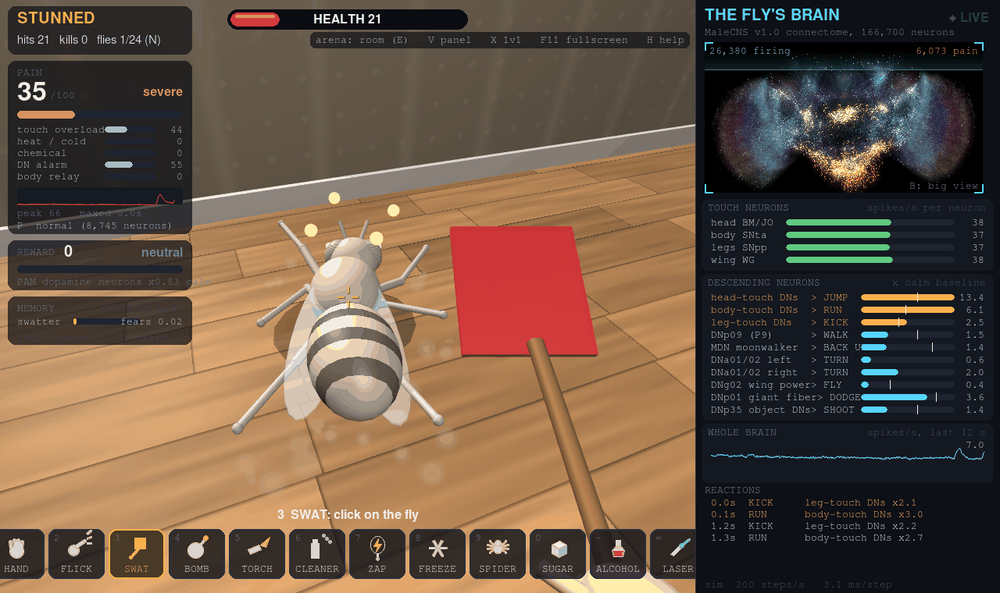

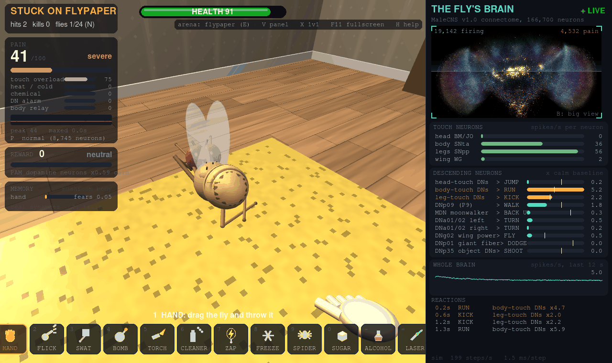

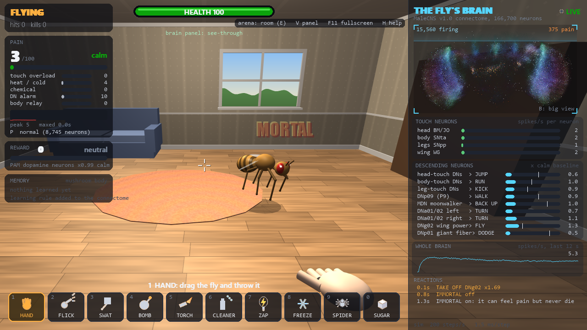

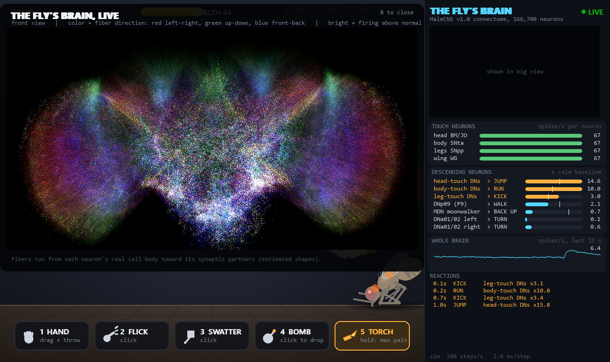

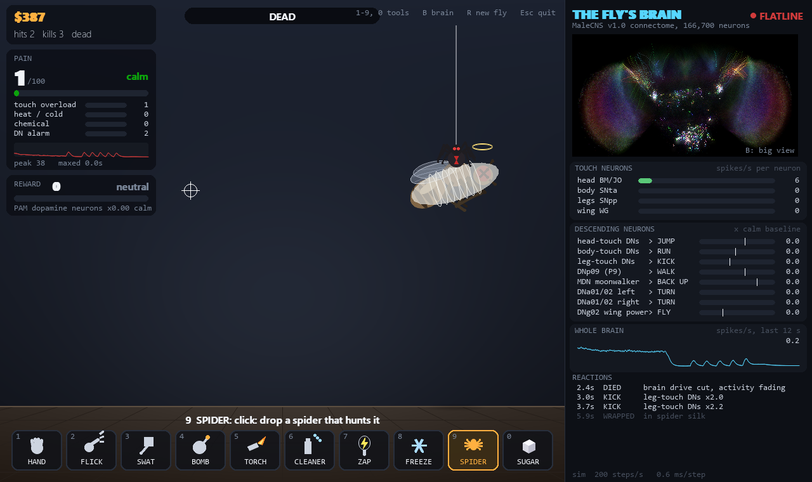

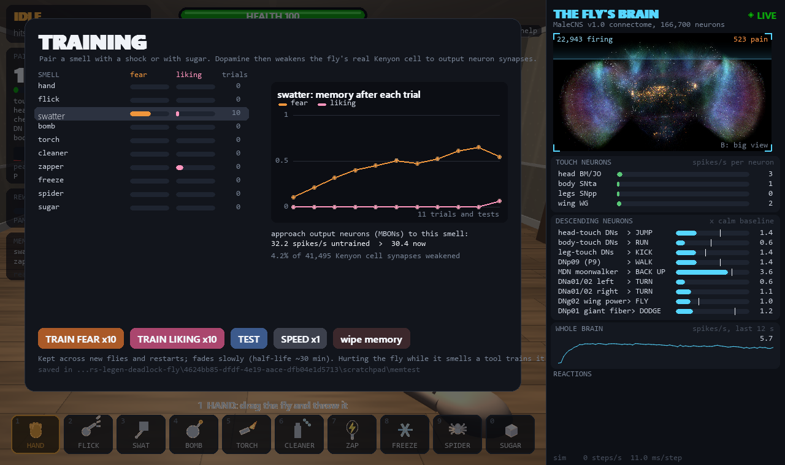

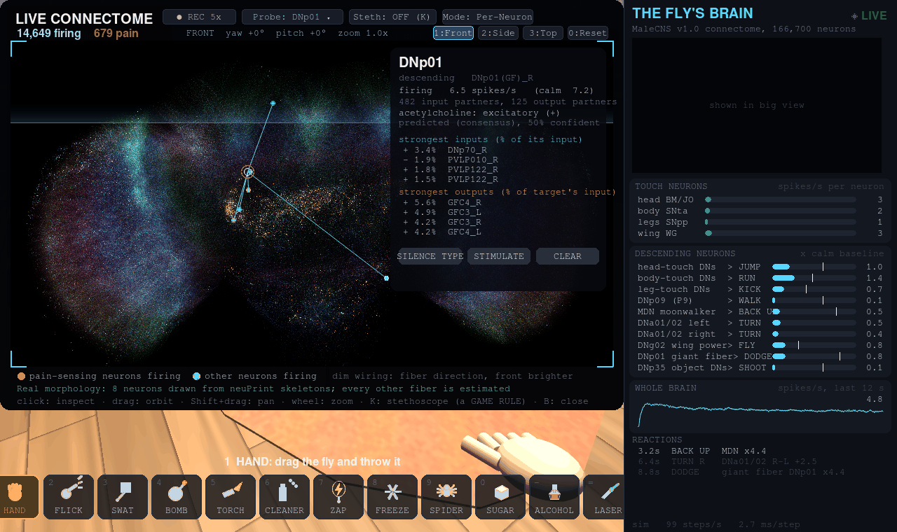

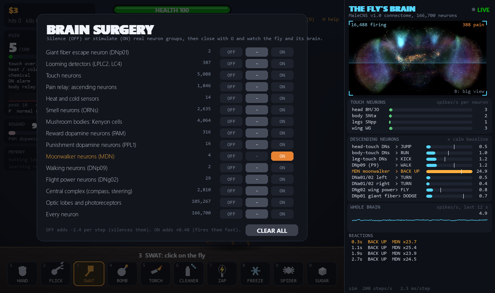

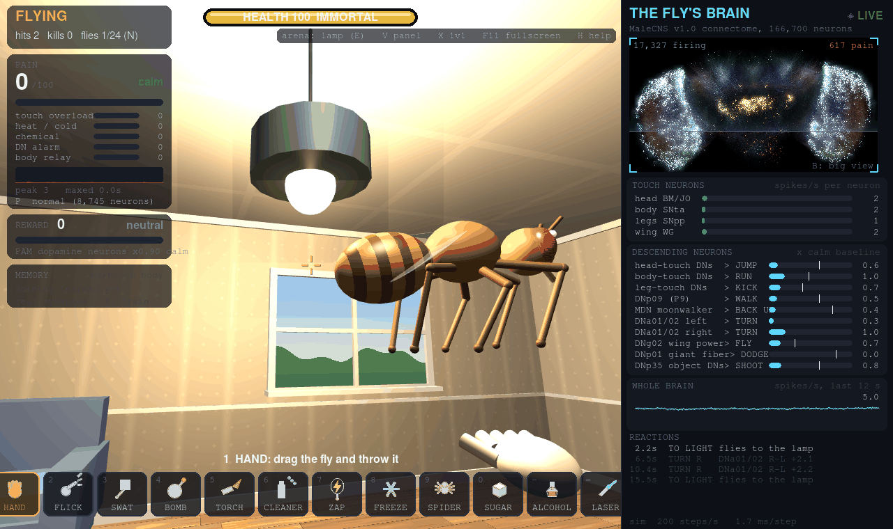

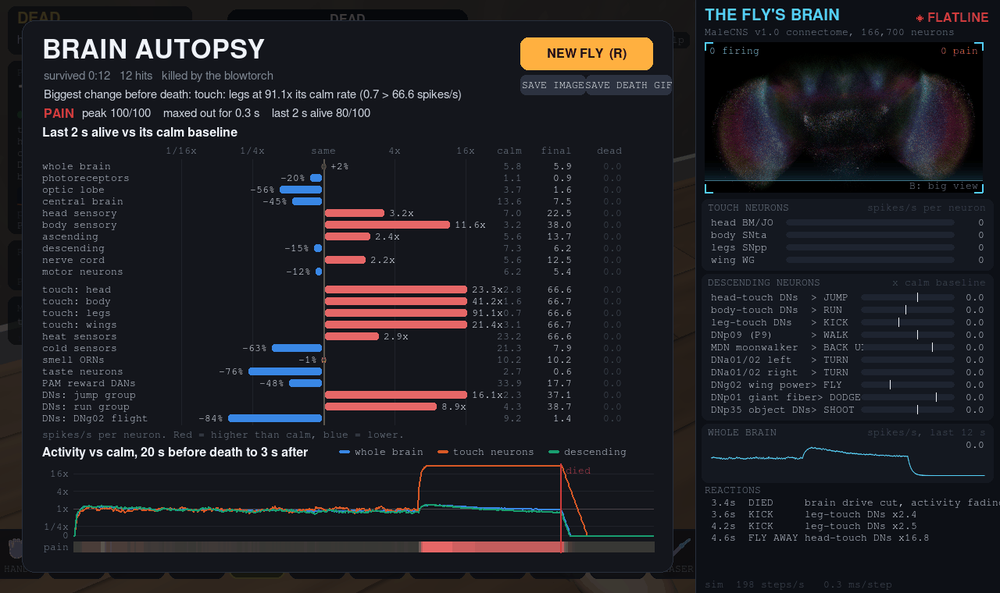

## Download and play (Windows)

**[Download KickTheFly.exe](https://github.com/legendarylolo318-cloud/kick-the-fly/releases/latest/download/KickTheFly.exe)** (about 90 MB) and double-click it. You don't need to install anything, and the fly's whole brain is inside the exe.

- **Startup:** the first launch takes a few seconds while the exe unpacks.
- **Windows warning:** the exe isn't code-signed, so Windows SmartScreen may say "Windows protected your PC". Click **More info**, then **Run anyway**.
- **Fullscreen:** press **F11**, or start it with `KickTheFly.exe --fullscreen`. It scales to any screen size.
- **If it crashes:** it writes `KickTheFly-crash.txt` next to the exe.

## Run from source

Needs Python 3.11, a GPU with OpenGL 3.3 for 3D, and about 1.5 GB of disk for the connectome.

```powershell
python -m venv .venv
.venv\Scripts\pip install -r requirements.txt
.venv\Scripts\python -m connectome.loader build     # downloads the connectome (~1.1 GB) and builds data/graph.pkl
.venv\Scripts\python kick_the_fly.py                # the first run packs data/kick_brain.npz (~30 s)
```

To build the exe yourself (after one run from source, so the brain pack exists):

```powershell
powershell -ExecutionPolicy Bypass -File build_exe.ps1
```

## Controls

| key | what it does |
|---|---|
| WASD | walk (Shift sprint, Ctrl crouch); walk into the fly to kick it |
| Mouse | look around; left click uses the tool in your hand |
| 1-9, 0 or mouse wheel | pick a tool: hand, flick, swatter, bomb, blowtorch, brake cleaner, zapper, freeze spray, spider, sugar |
| Tab | free the mouse to click the brain panel and menus (click the room to look again) |
| B | big live brain view; click a neuron to inspect it |
| O | brain surgery |
| T | training: teach it to fear or like a smell (saved between sessions) |
| E | arena: room, fan, flypaper, pool, lamp |
| P / I | pain neurons / immortal mode |
| M | mute |
| F12 / G | save a screenshot / a GIF of the last 6 seconds |
| V | brain panel: solid, see-through, faint, hidden (hidden gives the room the whole screen) |
| U | menu size: crisp (sharp whole-pixel scaling, the default) or large |
| F11 | fullscreen; the game fills any screen with no black bars |
| R | new fly |
| Esc | free the mouse, close menus, then quit |

Start with `--2d` for the original 2D game. It also starts automatically in 2D on PCs without OpenGL 3.3.

## What is the connectome and what is a game rule

**Connectome**
- The spiking model (leaky integrate-and-fire over 10.5M signed synapses) and all the neuron firing.
- Which sensory neurons each hit drives.
- The descending neurons read out for reactions. The jump, run and kick groups are the DN types that responded most to head, body and leg touch when the sim was probed.
- Take-off and flight speed come from DNg02, the wing-power descending neurons.
- Dodging: the looming detectors LPLC2 and LC4 exciting the giant fiber DNp01 is the connectome's own wiring. Driving LPLC2/LC4 takes DNp01 to 7–12× its calm rate, while on its own it never passed 2.6×.
- The wind, humidity and light neurons each arena fires, and the Kenyon cell patterns each tool's scent produces.
- The REWARD meter reads the PAM dopaminergic neurons.

**Game rules**
- Which move each neuron group triggers.
- The ragdoll physics and standing back up.
- Jump direction, stun and damage.
- The pain index. The adult connectome has no neurons annotated as nociceptors, so pain is an estimate built from real signals, not a measurement of what the fly feels.
- Death. A sim can't die on its own, so on death its tonic drive is switched off and activity fades out.
- Brake cleaner dissolving the fly, and the brain slowing as it dissolves. Solvents depress nervous systems, so an inhibitory current grows on every neuron as the fly melts. How strong it is was picked for the game, not measured. The smell and taste neurons it fires are real.
- Freezing and spider venom damping the brain, and the zapper's shock going into a random 30% of neurons (the sim has no current path to place it).
- Sugar switching on the PAM reward neurons directly. In this sim taste input alone doesn't reach them, so sugar drives them the way PAM activation experiments do. The fly walking to the sugar is also a game rule.
- How looming reaches the fly. The game measures how fast an object grows in its view and drives LPLC2/LC4 directly. Streaming pixels through the sim's own photoreceptors didn't work: the looming signal stayed inside the brain's random flicker.
- Learning. The plasticity happens on the connectome's own synapses: all 41,495 Kenyon cell to MBON connections that dopamine neurons reach. Which dopamine neurons gate which output neurons comes from the connectome's 37,909 dopamine to output neuron synapses: PPL1 punishment dopamine for MBON11-20 and 30-35, and PAM reward dopamine for MBON01-10, 21, 24 and 26-29. That matches the published map. The rule is the one found in real flies: dopamine plus Kenyon cell activity weakens the synapse. Game rules: pain driving PPL1, sugar driving PAM, each tool having a smell, and the learning rate and forgetting speed. In testing, 10 pairings raised fear of the trained smell from 0 to 0.65 while an untrained smell stayed at 0.01, and the trained smell's approach output neurons dropped from 32 to 30 spikes/s.
- Being drawn to the lamp, and the arena physics.
- The flight path.
- Everything about the 3D room: the fly's 3D body, physics, walking and flight, and your tools. They use the 2D game's tuned physics scaled to meters, so the brain gets the same kinds of hits as before. What triggers take-off is from the neurons, but where it flies is not.
- Fiber shapes in the brain view. Cell-body positions are real, but full neuron shapes aren't bundled, so each neuron is drawn from its cell body toward the center of its synaptic partners. Color is the fiber's direction: red left-right, green up-down, blue front-back.

The full mapping is in the docstring at the top of `kick_the_fly.py`.

## Credits

The connectome data is Janelia FlyEM MaleCNS v1.0, a collaboration between HHMI Janelia, the University of Cambridge, the MRC Laboratory of Molecular Biology and Google Research. It is licensed [CC BY 4.0](https://creativecommons.org/licenses/by/4.0/) and available at [male-cns.janelia.org](https://male-cns.janelia.org/download/).

The exe bundles a compact pack derived from that data. The pack keeps the signed synapse counts, the neuron labels and the cell-body positions, and is otherwise unmodified.
