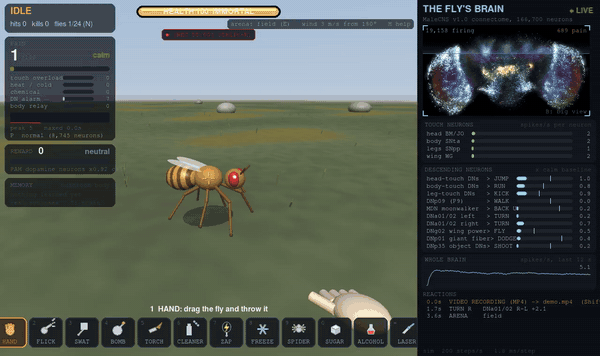
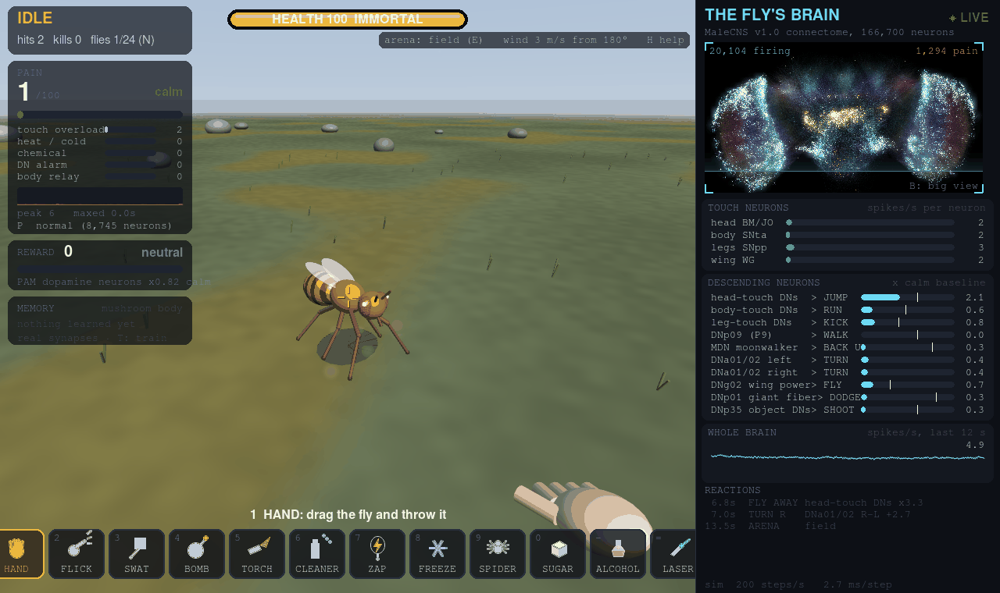
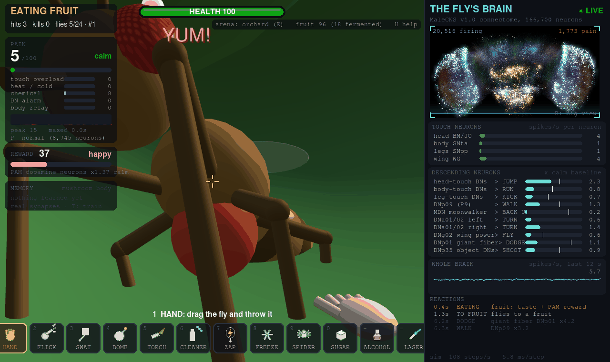
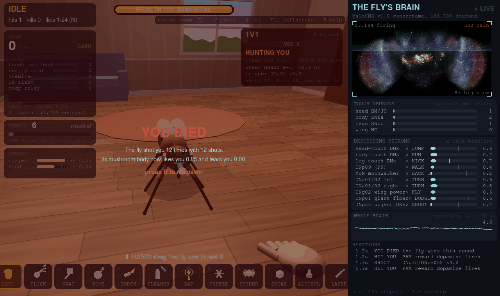
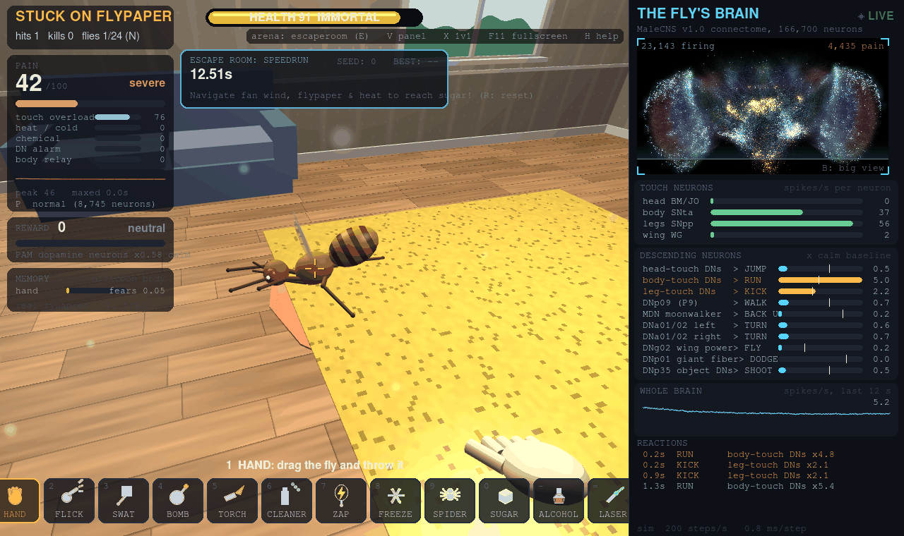
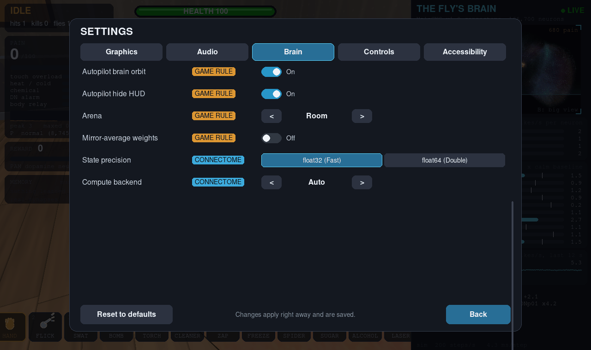
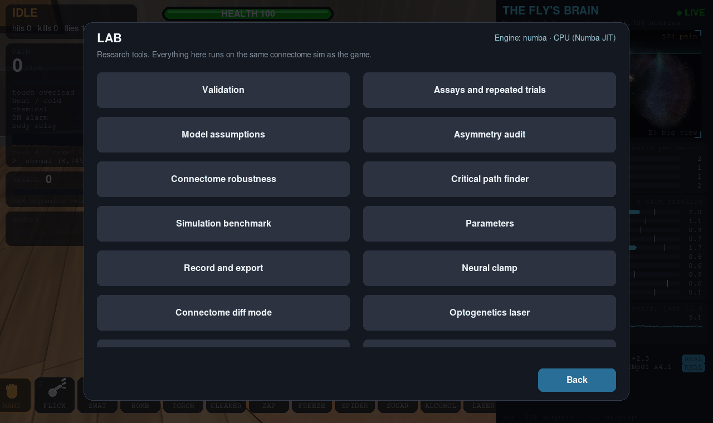
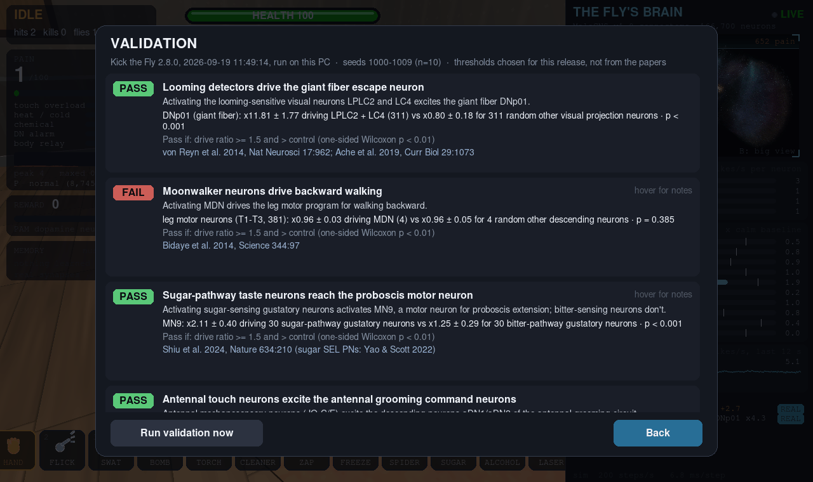
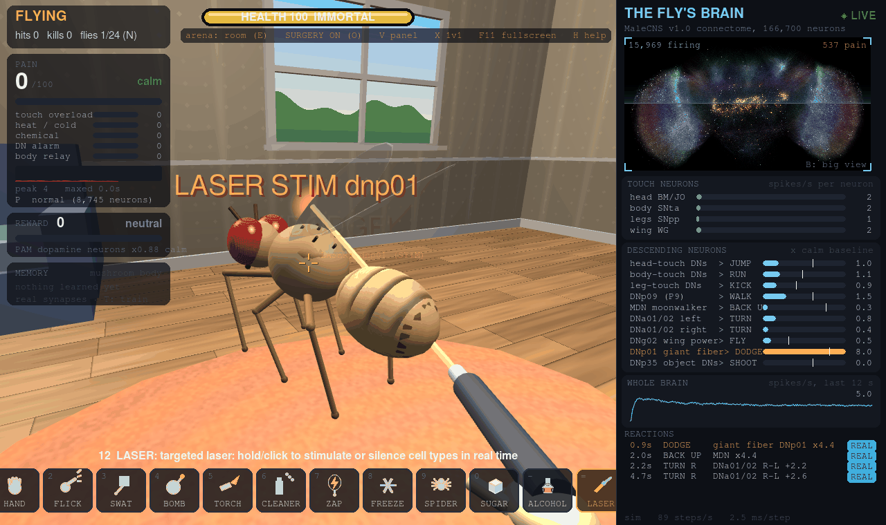

# Kick the Fly

A kick-the-buddy game where the buddy is a real fruit fly brain: the
**MaleCNS v1.0** connectome ([Google Research blog](https://research.google/blog/a-connectomics-milestone-mapping-the-complete-male-fruit-fly-brain/)),
all 166,700 neurons simulated live while you throw, swat, bomb, burn, dissolve, zap, freeze and feed it to a spider. Or reward it with sugar.

**It's first person:** walk around a 3D living room and use your tools on the fly up close. Walk into it and you kick it. Or take it outside: an **open field** with wind and sun, and an **orchard** where it flies to fruit and feeds. The original 2D version is still there with `--2d`.

**Play or Lab:** Play is the game, with challenges and scores. Lab mode adds research tools: a validation dashboard showing which published fly behaviors this simulation reproduces (and which it doesn't), repeated trials with statistics, data export and protocol files that also run headless.



*12 seconds in the open field, recorded with the in-game video recorder (Shift+R): a swat and the blowtorch fire its real touch and heat neurons, and the brain panel on the right shows all 166,700 neurons responding.*

- **Hits fire real sensory neurons:**
  - head: head bristles and Johnston's organ
  - body: tactile neurons
  - legs: proprioceptive neurons
  - wings: wing sensory neurons
  - blowtorch: heat-sensing neurons
  - brake cleaner: smell and taste neurons (and it dissolves the fly)
  - freeze spray: cold-sensing neurons
  - zapper: every touch neuron plus a shock through its brain
  - spider bites: body and leg touch neurons
- **Its reactions come from its descending neurons:** running, kicking, walking, backing up and turning.
- **It can fly:** it takes off when its DNg02 wing-power neurons fire above normal, and flies away when its head-touch escape neurons fire.
- **Pain meter:** built from touch overload, heat and cold sensors, chemical senses and descending-neuron alarm. The **blowtorch** and **brake cleaner** max it out.
- **More pain neurons (P):** the wiring can't gain neurons, so the pain setting listens to more of the fly's real ones. **Normal** uses 9,080. **More** uses 11,392 and adds the rest of the body's sensory neurons. **Max** uses 13,238 and adds the ascending neurons that relay body signals to the brain. Higher settings also make each hit fire more of them.
- **Immortal mode (I):** it feels everything but can't die. It heals when you stop, and breaks out of spider silk.
- **Reward:** drop **sugar** and it walks over to eat. That lights up its PAM dopamine reward neurons and heals it. Its sugar-pathway taste neurons fire its proboscis motor neuron MN9, and when MN9 responds its proboscis comes out.
- **Alcohol (-):** drop a droplet of fermented fruit and the fly walks over and sips it. Drinking drives its real sweet taste pathway and its PAM dopamine reward neurons, the same ones sugar does, and its smell comes through the real fermentation glomeruli (DM1, DM2, DP1m). Getting drunk is a **game rule**: an inebriation level builds up with every sip and wears off over about 45 seconds, and while it lasts the game gives the fly tremors, a stumbling gait, wobbly flight and slower escape reflexes. No neuron in the simulation is actually intoxicated.
- **Death and autopsy:** it can die. The autopsy compares every brain region's last 2 s alive with its calm baseline, and shows pain on a timeline.
- **It sees you coming:** move a weapon at it fast and its real looming detectors (LPLC2 and LC4) fire its giant fiber escape neuron, so it dodges. Sneak up slowly and it won't notice.
- **Brain surgery (O):** silence or stimulate real neuron groups and watch what happens. Switch on the moonwalker neurons and it backs up; silence the giant fiber and it can't dodge.
- **Neuron inspector:** in the big brain view, click any neuron to see its type, how fast it's firing, and its strongest connections in the connectome.
- **1v1 duel (X):** the fly gets a blaster and can kill you, and every part of the fight runs through its brain:
  - it sees you through its real target-tracking neurons (LC10), which steer it toward you through its steering neurons (DNa02);
  - it shoots when its small-object detectors fire its DNp35 neurons;
  - landing a hit fires its reward dopamine neurons, so it learns to like hunting you;
  - hurting it fires its punishment dopamine neurons, so it learns to fear you, and it runs away and stops shooting.

  Silence its tracking neurons in brain surgery and it can't aim.
- **Multiple flies (N):** press N to spawn another fly, each running its own complete, independent connectome — 166,700 neurons apiece. Up to 16 flies (in the exe and AppImage, and from source on plain NumPy), or one per CPU core, up to 32, with the optional Numba backend (see [Performance](#performance)); each needs about 350 MB of free memory. They notice each other for real: a fly closing in fast fires another's actual looming detectors (LPLC2/LC4) and makes it dodge, and bumping into each other fires real touch neurons. Press **F** to pick which fly the brain panel, surgery and training follow (for 5 s; otherwise they follow the fly nearest you). Only the original fly's mushroom-body learning is saved between sessions. Every fly is its own brain thread, so with many flies the brains can fall behind real time (see Performance).
- **Real training (T):** the fly learns with its actual mushroom body. Pair a smell with a shock or with sugar and dopamine weakens the real Kenyon cell to output neuron synapses for that smell, just like in real flies. The Training panel runs lab-style conditioning and graphs the learning curve. Memory is saved between flies and sessions (see File locations). Hurting the fly while it smells a tool trains it too.
- **Arenas (E):**
  - **fan:** wind that fires its wind-sensing neurons, which excite its antennal grooming command neurons
  - **flypaper:** it gets stuck and struggles
  - **pool:** it floats, gets wet wings, and can drown
  - **lamp:** it's drawn to the light and singes itself on the bulb
  - **escaperoom:** multi-hazard gauntlet combining fan wind, flypaper strip, and hot lamp overhead; reach the sugar dish to stop the speedrun timer and generate a tamper-evident verification code (`KTF-<SEED>-<TIME>-<SIG>`).
  - **open field** (3D): 30 m by 30 m of grass, rocks and open sky. A steady wind drives its real wind-sensing antennal neurons and the sun drives its photoreceptors; wind direction and strength and the sun's position are Lab parameters. Wind also reaches its head-touch escape neurons, so in a breeze it keeps flying off, and outdoors an escape really goes somewhere: fly out of sight (26 m from you, or 15 m up) and it's **lost**. **J** calls it back.
  - **orchard** (3D): a grove of 24 fruit trees. The fly flies to a ripe fruit, lands and feeds, which drives the same real taste and PAM reward neurons sugar does and heals it. Each fruit holds a few feeds and shrinks and browns as it's eaten, then drops; it grows back after about 75 s, staggered, with a cap per tree. Some fruit are fermented and act like the alcohol tool. The fruit, the trees and the flying to them are **game rules**: the fly doesn't forage through its own circuitry. With several flies they end up competing for fruit, but only through the looming and touch neurons they already have; nothing about competing is scripted.

  Open field and orchard need the 3D game; the 2D game stays indoors and says so. The arena you pick is saved in `config.toml` (Settings > Brain > Arena, or **E**), in save states and in every export's metadata.
- **Save and share:** **F12** (3D) or **S** (2D) saves a screenshot and **G** saves a GIF of the last 6 seconds. **Shift+R** starts a **video** of any length and Shift+R again stops it: an MP4 if [ffmpeg](https://ffmpeg.org/) is installed (on your PATH), otherwise a GIF (smaller, up to 60 s). It plays back at real speed however fast the game draws, and a red badge shows how long you've been recording. `--record-video [PATH]` starts one at launch. **L** toggles time-lapse recording (2x, 5x, 10x or 20x speed-up, to MP4 or GIF). The autopsy can save a GIF of the death. Everything goes to your screenshots folder (see File locations).
- **Slow motion and save states:** pause time, slow everything to 0.1x, step it 1/60 s at a time, and save or load the whole simulation (see Time controls).
- **Live brain view:** a front view of the brain built from the neurons' real cell-body positions, shaded by depth. Almost every neuron is drawn as an estimated fiber toward its synaptic partners; ten of them (two each of the giant fiber DNp01, the DNa02 steering neurons, MBON01, MBON14 and a Kenyon cell type) are drawn from their **real reconstructed shapes**, sampled from their EM skeletons on Janelia's neuPrint and downloaded once, then cached (offline and uncached they fall back to estimated fibers, and the big view says which). Pain-sensing neurons glow orange and everything else glows cyan when firing (blue/yellow and high-contrast palettes in Settings > Accessibility). Press **B** for the big view.

## Screenshots

All from the current build at 1280x760, made by `tools/make_screenshots.py` (see CONTRIBUTING.md to remake them).

**The room.** First person, with the fly's live brain on the right.


**Swatting.** Its touch neurons fire, and the head-, body- and leg-touch descending neurons that drive jumping, running and kicking light up.


**Flypaper.** Stuck, it struggles through its own body- and leg-touch neurons and their descending neurons.


**The open field.** Grass, rocks and sky; the wind drives its real antennal wind neurons, and escapes carry it away.



**The see-through brain panel (V),** here in the open field: the world shows through the brain.


**The orchard,** from inside a fruit tree's crown: one of five flies feeding on a fruit. Feeding drives the same taste and PAM reward neurons as the sugar tool, so its REWARD meter reads happy.



**The blowtorch in the big brain view (B).** Every touch and heat neuron is pinned and the brain lights up.


**A spider** drops, bites twice and wraps the fly in silk (immortal here, so it breaks free after five bites).


**1v1 duel (X).** The fly aims with its LC10 -> DNa02 steering pathway and fires when its DNp35 object neurons do. Here it has hit you 6 times out of 7 shots; every hit fires its reward dopamine neurons, so its REWARD meter reads bliss and its mushroom body now likes you 0.49.



**Training (T).** Ten shock pairings with the swatter's smell weaken its real Kenyon cell -> MBON synapses; the curve is its fear after each trial.


**Neuron inspector.** Click a neuron in the big view for its type, firing, transmitter and strongest connections. The giant fiber shown here is one of the neurons drawn from its real neuPrint skeleton.


**Brain surgery (O).** Switching the moonwalker neurons (MDN) on makes it back up.


**The lamp.** It's drawn to the light: here it flies up to the bulb (touching the bulb singes it).


**The escape room.** Fan, flypaper and a hot lamp stand between the fly and the sugar dish.



**Autopsy.** Every brain region's last 2 s alive against its calm baseline, and pain on a timeline.


**Settings (Esc > Settings), Brain tab.** Each setting is tagged Connectome (changes the simulation) or Game rule, including the compute backend and state precision.



**Lab mode.** The research tools, with the simulation engine that's running shown top right.



**Lab > Validation.** Which published fly behaviors this simulation reproduces, with the numbers and criteria, and which it doesn't.



**The optogenetics laser (Lab, key =).** Aim it and it drives, or silences, a chosen cell type; here it drives the giant fiber DNp01.



## Download and play (Windows)

**[Download KickTheFly.exe](https://github.com/legendarylolo318-cloud/kick-the-fly/releases/latest/download/KickTheFly.exe)** (about 90 MB) and double-click it. You don't need to install anything, and the fly's whole brain is inside the exe.

- **Startup:** the first launch takes a few seconds while the exe unpacks.
- **Windows warning:** the exe isn't code-signed, so Windows SmartScreen may say "Windows protected your PC". Click **More info**, then **Run anyway**.
- **Your fly remembers:** training memory from earlier versions is still read from `Documents\Kick the Fly\memory`, including a Documents folder moved to OneDrive. Nothing is moved or deleted.
- **Fullscreen and sharp scaling:** press **F11**, or start it with `KickTheFly.exe --fullscreen`. The game is DPI aware, so 125% and 150% displays draw at full resolution instead of blurry.
- **Headless:** `start /wait KickTheFly.exe --headless --protocol smoke.yaml --out results` runs without a window (bundled protocols can be named without a folder; see Lab tools).
- **If it crashes:** it writes `KickTheFly-crash.txt` next to the exe and in `%LOCALAPPDATA%\Kick the Fly`.
- **Checksums:** each release has `SHA256SUMS`; `Get-FileHash KickTheFly.exe` should match.

## Download and play (Linux)

**[Download KickTheFly-x86_64.AppImage](https://github.com/legendarylolo318-cloud/kick-the-fly/releases/latest/download/KickTheFly-x86_64.AppImage)** (about 110 MB), `chmod +x` it, and run it. No install needed, and the fly's whole brain is inside it. It's built on Ubuntu 22.04, so it runs on most distros from then on.

- **Startup:** the first launch takes a few seconds while it unpacks.
- **Arch Linux:** an AUR package `kickthefly-bin` is in `packaging/aur/` (installs the release AppImage and a menu entry).
- **Wayland and X11:** it uses native Wayland when `WAYLAND_DISPLAY` is set and falls back to X11/XWayland by itself if that fails. Force one with `--backend wayland` or `--backend x11`, or in Settings > Graphics (applies on restart). An `SDL_VIDEODRIVER` you set yourself always wins. Mouse look uses relative pointer mode on both.
- **GPU:** needs OpenGL 3.3 for the 3D room. Without it the game logs why and starts the 2D game (`--2d` skips the check). Software rendering (`LIBGL_ALWAYS_SOFTWARE=1`) works but is slow.
- **If it won't start (FUSE):** AppImages mount themselves with FUSE. Without FUSE (no `libfuse2`/`fusermount`, containers, some minimal distros) run `./KickTheFly-x86_64.AppImage --appimage-extract-and-run`, or set `APPIMAGE_EXTRACT_AND_RUN=1`. `sudo apt install libfuse2` fixes it on Debian/Ubuntu.
- **Headless over SSH:** `./KickTheFly-x86_64.AppImage --headless --protocol smoke.yaml` works with no `DISPLAY` or `WAYLAND_DISPLAY`.
- **Sound:** plays through PulseAudio (including PipeWire's PulseAudio server) or ALSA.
- **If it crashes:** it writes `KickTheFly-crash.txt` next to the AppImage and in `~/.local/state/kickthefly/`.

## File locations

| | Windows | Linux |
|---|---|---|
| settings (`config.toml`) | `%APPDATA%\Kick the Fly` | `$XDG_CONFIG_HOME/kickthefly` (`~/.config/kickthefly`) |
| training memory | `Documents\Kick the Fly\memory` | `$XDG_DATA_HOME/kickthefly/memory` (`~/.local/share/kickthefly/memory`) |
| save states | `Documents\Kick the Fly\saves` | `~/.local/share/kickthefly/saves` |
| exports, scores, validation runs | `Documents\Kick the Fly` | `~/.local/share/kickthefly` |
| your protocol files | `Documents\Kick the Fly\protocols` | `~/.local/share/kickthefly/protocols` |
| screenshots, GIFs and videos | `Pictures\Kick the Fly` | `<xdg-user-dir PICTURES>/Kick the Fly` (`~/Pictures/Kick the Fly`) |
| neuPrint skeleton cache | `Documents\Kick the Fly\skeletons` | `~/.local/share/kickthefly/skeletons` (from source: `data/skeletons/`) |
| crash reports and log | `%LOCALAPPDATA%\Kick the Fly` | `$XDG_STATE_HOME/kickthefly` (`~/.local/state/kickthefly`) |

Documents and Pictures on Windows come from the Known Folders API, so redirected and OneDrive folders work. On Linux, versions before 2.6 used `~/Documents/Kick the Fly/memory` and `~/Pictures/Kick the Fly`; on first launch the memory and any screenshots are copied to the new locations and the originals are left alone. A broken or missing `config.toml` falls back to default settings with a warning (a broken one is kept as `config.toml.bad`). `KICK_THE_FLY_HOME=/some/folder` keeps everything in one folder (portable use, tests).

## Repo layout

```
kick_the_fly.py            launcher shim: `python kick_the_fly.py ...` works exactly as before
kickthefly/                the package everything lives in (`python -m kickthefly` runs the same game)
  core/                    clock, save states, settings, user folders, crash reports, version
  sim/                     the connectome: loader, brain pack, the LIF simulator
  game/                    the 2D game, the 3D room, physics, tools, arenas
  ui/                      menu framework and settings screens
  lab/                     validation, assays, challenges, statistics, protocols, recording and export, Lab tools
  data/                    non-code assets bundled inside the package
tests/  protocols/  docs/  packaging/  tools/
data/                      not in git: the connectome download, graph.pkl and the brain pack
```

The canonical map of what comes from the connectome and what is a game rule is the module docstring at the top of
`kickthefly/game/kick_the_fly.py`; the shim in the repo root points at it. `CONTRIBUTING.md` says where new code
goes. This layout arrived in 2.7; nothing user-facing moved, so existing saves, training memory, settings, protocol
files and command lines are unchanged.

## Run from source

Needs Python 3.11, a GPU with OpenGL 3.3 for 3D, and about 1.5 GB of disk for the connectome.

```powershell
python -m venv .venv
.venv\Scripts\pip install -r requirements.txt
.venv\Scripts\python -m kickthefly.sim.connectome.loader build   # downloads the connectome (~1.1 GB) and builds data/graph.pkl
.venv\Scripts\python kick_the_fly.py                # the first run packs data/kick_brain.npz (~30 s)
```

On Linux/macOS, use `python3` and forward slashes instead:

```bash
python3 -m venv .venv
.venv/bin/pip install -r requirements.txt
.venv/bin/python -m kickthefly.sim.connectome.loader build   # downloads the connectome (~1.1 GB) and builds data/graph.pkl
.venv/bin/python kick_the_fly.py                    # the first run packs data/kick_brain.npz (~30 s)
```

### Optional: faster simulation with Numba or PyTorch

The brain simulation runs on plain NumPy by default. Two optional libraries can run it instead; install one and the
game uses it by itself (`auto`), or pick one in Settings > Brain > Compute backend or with `--backend NAME`:

| backend | install | what it does |
|---|---|---|
| `numba` | `pip install numba` | JIT-compiled CPU kernels that release Python's interpreter lock, so several flies' brains run in parallel ([numbers](#performance)) |
| `torch-cuda` | PyTorch with CUDA, from the selector on [pytorch.org](https://pytorch.org/get-started/locally/) | NVIDIA GPU |
| `torch-rocm` | PyTorch with ROCm (Linux), from the same selector | AMD GPU |
| `torch-cpu` | any PyTorch | PyTorch on the CPU; mainly for checking the torch code path |

`auto` prefers a GPU, then Numba, then NumPy. A backend that can't start (library missing, no GPU visible to that
PyTorch build) falls back to NumPy and logs why; the backend that actually ran is what the Lab header, benchmarks,
validation results, exports, save states and crash reports record. Numba and `torch-cpu` give **exactly** the same
spikes as NumPy, so every result in this README is the same on them; GPU backends agree statistically but not spike for
spike (see [Deterministic runs](#time-controls-and-save-states)). The number of flies you can spawn depends on the
backend (see Controls: N).

**The exe and the AppImage include neither.** They always run the NumPy backend and don't pick up a Numba or PyTorch
you've installed on your system (a frozen app can't safely load another Python's packages); choosing another backend
there falls back to NumPy with a note in the log. For Numba or a GPU, run from source.

Tests (the validation suite takes a few minutes; `-m "not validation"` skips it):

```bash
.venv/bin/pip install pytest
.venv/bin/python -m pytest
```

To build the exe yourself (after one run from source, so the brain pack exists; add `data/validation_results.json` from `--validate` for the real-science popups):

```powershell
powershell -ExecutionPolicy Bypass -File build_exe.ps1
```

To build the AppImage yourself (same prerequisite):

```bash
./build_appimage.sh
```

Releases are built by `.github/workflows/release.yml` on a tag push: the brain pack is built from the public connectome, all tests (including validation) run on Ubuntu 22.04 and Windows, the AppImage is built on Ubuntu 22.04 and the exe on Windows, and the release is published with `SHA256SUMS` only if everything passes.

## Controls

Every key below can be rebound in Settings > Controls (a key that's already taken swaps with that action). Esc and the tool keys (1-9, 0, - and =) are fixed.

| key | what it does |
|---|---|
| Esc | close a panel, or open the pause menu: Resume, Challenges (Play) or Lab tools (Lab), Settings, Save State, Load State, Mode, Quit |
| WASD | walk (Shift sprint, Ctrl or C crouch); walk into the fly to kick it |
| Mouse | look around; left click uses the tool in your hand |
| 1-9, 0, -, = or mouse wheel | pick a tool: hand, flick, swatter, bomb, blowtorch, brake cleaner, zapper, freeze spray, spider, sugar, alcohol, laser |
| Tab | free the mouse to click the brain panel and menus (click the room to look again) |
| B | big live brain view; click a neuron to inspect it |
| O | brain surgery |
| T | training: teach it to fear or like a smell (saved between sessions) |
| X | 1v1 duel: the fly gets a blaster and can kill you (R respawns you) |
| E | arena: room, fan, flypaper, pool, lamp, escape room, open field, orchard (the last two 3D only) |
| J | outdoors: call back a fly that flew out of sight |
| P / I | pain neurons / immortal mode |
| K | brain stethoscope (spike sonification clicks in big brain view / body parts) |
| L | time-lapse record (2x-20x speedup to MP4/GIF; toggle on/off) |
| Shift+R | start or stop a video (MP4 with ffmpeg, else GIF) |
| Y | autopilot / spectator mode (hands-off orbit camera) |
| F10 | photo mode / free camera with depth of field |
| M | mute |
| F12 (S in 2D) / G | save a screenshot / a GIF of the last 6 seconds |
| V | brain panel: solid, see-through, faint, hidden (hidden gives the room the whole screen) |
| U | menu size: crisp (sharp whole-pixel scaling, the default) or large |
| F11 or Alt+Enter | fullscreen; the game fills any screen with no black bars |
| N | spawn another fly, each with its own independent brain (up to 16; up to one per CPU core, max 32, on Numba) |
| F | pick which fly the brain panel, surgery and training follow (for 5 s, then back to the nearest) |
| R | reset to a single fresh fly |
| Z | pause or resume time |
| [ / ] | slower / faster: 0.1x, 0.25x, 0.5x, 1x |
| . | single step while paused (1/60 s of the room and the matching brain steps) |
| H | controls help |

Command line: `--2d`, `--fullscreen`, `--backend NAME` (a simulation backend: `auto`, `cpu`, `numba`, `torch-cpu`, `torch-cuda`, `torch-rocm`; or, on Linux, the display backend `wayland` or `x11` as before), `--sim-backend NAME` (the simulation backend only), `--dtype float32|float64`, `--record-video [PATH]`, `--seed N`, `--arena NAME` (room, fan, flypaper, pool, lamp, escaperoom, field, orchard), `--flies N` (start with N flies), and for headless runs `--headless`, `--validate`, `--protocol FILE`, `--nwb`, `--out PATH`, `--workers N`, `--seeds 1000-1009`, `--strict`, `--threshold-sweep`, `--signflip-test`, `--critical-path TARGET`, `--benchmark`.

## Settings

Esc > Settings. Changes apply right away and are saved to `config.toml`; hover any setting for a plain explanation.

- **Graphics:** fullscreen, resolution scale (3D drawn smaller and stretched, for weak GPUs), FPS cap, VSync (restart), display backend (Linux only, restart), brain panel style, menu size, UI scale.
- **Audio:** master, wing buzz and sound effects volume, brain stethoscope (spike sonification clicks, hotkey K), mute.
- **Brain:** Play/Lab mode, arena, pain neurons, immortal, sim speed, random seed (applies on R), real vs rule tags, real-science popups, compute backend (see [Optional: faster simulation](#optional-faster-simulation-with-numba-or-pytorch)) and state precision (float32, the default, or float64). Brain settings are tagged **Connectome** (changes how the simulation runs) or **Game rule** (a rule the game adds on top).
- **Controls:** mouse sensitivity, invert Y, field of view, key bindings.
- **Accessibility:** colorblind-safe brain view colors (blue/yellow) and a high-contrast palette, reduced flashing (no screen shake, flashes, sparkles, scanning band or blinking), larger text.

## Play and Lab

**Play** (the default) is the game plus **challenges** in the pause menu, each built on a real experiment or neural readout:

- **Teach it to pick the right door:** pick which of two smelly doors zaps. The fly is trained on its real mushroom body, then chooses a door 10 times. Score: right choices. The practice memory is put back afterwards, so it never changes how the fly treats your tools.
- **How close can you sneak?:** creep up on the fly. When its giant fiber fires it dodges. Score: how close you got, in fly lengths.
- **Find its sweet tooth:** offer sugar at different strengths and find the weakest one its proboscis motor neuron still responds to, in 8 tries.
- **Mystery defect (Reverse brain surgery):** one circuit is turned off at random (curated, unambiguous circuits). Test the fly with tools, request hints, and deduce what is missing without neuroscience jargon.
- **Predict the move (Motor readouts):** test your reflexes predicting motor readouts from real descending neuron spike surges (jump, run, kick, back up, take off) before the fly moves.

In Play mode a short **"Real flies do this too"** card appears the first time the fly does something that passed this game's validation (dodging, reaching for sugar with its proboscis, its antennal grooming neurons firing in the fan's wind, avoiding a smell it learned to fear). Behaviors that failed validation never get one. Turn the cards off in Settings > Brain.

**Lab** (Esc > Mode, or Settings > Brain) replaces Challenges with **Lab tools**:

- **Validation:** every test with PASS or FAIL, the measured numbers, the pass criteria and the citation. "Run validation now" reruns the suite on your PC. Includes negative validation results (e.g. E-PG compass bump formation without visual cues, correctly reported as absent without a false HUD).
- **Assays and repeated trials:** T-maze conditioning (Tully & Quinn performance index), looming escape (escape probability, latency and distance vs approach speed) and sugar response (MN9 dose-response) over any number of flies (seeds), with mean and 95% confidence interval. Pick a surgery and every fly also runs unperturbed with the same seed as its control, compared with a paired Wilcoxon signed-rank test (paired t-test and, for yes/no outcomes, Fisher's exact test alongside). Each fly is a fresh, untrained brain in a worker process; your saved training memory isn't touched. Results export to JSON and CSV.
- **Psychometrics generator:** sweep any stimulus parameter across a continuous range, run N trials per level with mean and 95% confidence interval error bars, and export publication-ready vector figures (pure vector PDF-1.4, SVG) and raw CSV data.
- **Optogenetics laser:** in-world aimable beam activating or silencing selected cell types directly in real time for rapid perturbation experiments.
- **Classroom mode & lecture protocols:** self-contained teaching modules with guided steps, hypothesis prompts, and bundled interactive YAML lecture protocols (`protocols/lecture_*.yaml`).
- **Parameters:** the LIF model's parameters (noise, tonic drive, target rate, sensory gain, gain adaptation; tagged MODEL) and the game-rule thresholds that turn neuron firing into moves, live. Validation results, exports and save states record when anything is changed from the defaults.
- **Record and export:** pick neuron groups and a duration and record the fly you're looking at while you play: spike times and firing rates as CSV and npz, with a metadata JSON (app version, seed, parameters, thresholds, connectome version, brain pack checksum, surgery, arena and its weather/fruit settings). Tick **NWB** to also get one Neurodata Without Borders file (units with spike times and connectome labels, per-group and per-region rates, stimuli, tool events, the fly's movement, surgery, arena, KC->MBON weights before and after, full metadata and the MaleCNS v1.0 / CC BY 4.0 citation). NWB needs `pip install pynwb`; it isn't bundled in the exe or AppImage, and the checkbox says so when it's missing.
- **Critical path finder:** pick a validated behavior or an assay and it silences each candidate cell type in turn (a shortlist ranked by how much of the readout's input they supply within two synapses), re-runs it over the validation seeds against same-seed unperturbed controls, and ranks the types by effect with 95% CI and a paired Wilcoxon test. Resumable, CSV/JSON export, and a one-click "apply this lesion" in the game. Headless: `--critical-path TARGET`.
- **Outdoor arena parameters:** open field wind direction and speed, sun azimuth and elevation, and the orchard's feeds per fruit, regrow time and fruit cap (all GAME RULE). They're also valid protocol `params`, and `assay: orchard` runs the orchard's feeding schedule headless and reproducibly (`protocols/orchard-feeding.yaml`).
- **Simulation benchmark:** runs 1, 8 and 16 flies on the compute backend you picked and reports the one that actually ran and its device, paced and uncapped steps/s and the sim/real ratio, neuron updates/s, synaptic events/s (measured spikes x the mean out-degree of 61.6) and the process's memory. Headless: `--benchmark --backend NAME --flies 1 8 16 32 --seconds 5`.
- **Connectome robustness & research findings:**
  - **Synapse threshold sweeps:** drops connections below any synapse count and re-runs the validated behaviors with validation's own criteria (seeds 1000-1009). The brain pack is already filtered at 3 synapses, so 1-3 change nothing. Pruning below 10 synapses removes 73.6% of all connections (7,562,973) and every input of 10,151 neurons, yet all 4 validated behaviors survive. Watch the rates, not only the ratios: a pruned brain is quieter at rest, so looming's ratio rises (11.8 -> 20.3) while DNp01's driven rate stays at 66.5 spikes/s.
  - **Transmitter sign flips:** flips a random half of the neurons whose transmitter the dataset is less than 70% sure of (11,013, of which 4,366 have no confidence at all), over randomized trials. In 3 trials on seeds 1000-1006: looming -> giant fiber survives 3/3 (x13.2 vs x11.7 unperturbed) and antennal -> aDN survives 3/3 (x3.6 vs x4.9), while sugar -> MN9 fails 3/3 (x1.06 vs x2.22).
  - **Looming critical path:** single-group silencing shows LC4 (-50%) and LPLC2 (-43%) carry nearly all looming drive; other visual groups have near-zero effect.
  - **Global inhibition block (Picrotoxin):** 0-100% severity slider scales inhibitory synapses down (`inhibition_scale = 1 - severity`). Runaway firing emerges from disinhibition without scripted seizures: at 100% the brain-wide mean goes from 6.7 to 33.8 spikes/s (one seed, 1 s; re-checked for this release). Reports before/after firing distributions.
- **Neural clamp:** records spike trains from a reference run and replays forced spikes into an altered connectome (lesion, threshold, sign-flip) to isolate wiring changes from sensory feedback. Dynamic clamping overrides intrinsic membrane state and breaks closed-loop feedback loops (e.g. proprioception and visual flow). Shows side-by-side activity diffs and exports.
- **Connectome diff mode:** runs two flies (reference vs perturbed) side-by-side with identical seeds and inputs in lockstep. Tracks region-by-region activity divergence live with an autopsy-style diverging bar chart and a timeline showing when the two brains diverge.
- **Hemifield & hemisphere lesions:** one-click surgery silencing unilateral visual pathways (LC10, LPLC2, LC4, LPTC, VS, HS) or an entire hemisphere. Demonstrates blind-side dodge failure, asymmetric steering bias, and broken 1v1 duel tracking. Reported strictly as a connectome wiring outcome, not physical injury.
- **Protocols:** YAML experiment files, from the bundled examples or your protocols folder.
- **Real vs rule tags** are on by default in Lab: each reaction in the brain panel and its popup is tagged REAL (live descending-neuron firing crossed a threshold; the movement itself is always game physics) or RULE (a game rule). In morphology, key cell types use REAL EM skeletons from neuPrint with fallback to synthetic fibers.

## Lab tools: protocols and headless runs

A protocol is either a stimulus schedule with recordings or a standard assay over many flies:

```yaml
name: looming-giant-fiber
seed: 100
flies: 5
warmup_s: 2
duration_s: 3
surgery: {"type:LPLC2,LC4": -1}     # silence (-1) or stimulate (1); each seed also runs unperturbed as its control
stimuli:
  - {at_s: 1.0, for_s: 1.0, target: loom, strength: 0.9, recruit: 0.6}      # game-style stimulus
  - {at_s: 2.5, for_s: 0.5, target: "type:MDN", mode: drive, amp: 0.5}      # constant activation
recordings:
  - {name: giant_fiber, neurons: dnp01}
  - {name: descending, neurons: "superclass:descending_neuron"}
```

```yaml
name: kc-silencing-tmaze
assay: tmaze          # tmaze | looming | sugar
seed: 3000
flies: 6
surgery: {"prefix:KC": -1}
```

Neurons are named by a group (`loom`, `escape`, `head`, `reward`, `sweet`, `dnp01`, `mn9`, `adn`, `jo_ce`, `mn_front`...), `type:A,B`, `prefix:KC`, `superclass:descending_neuron` or `rows:1,2,3`. The full format is in `kickthefly/lab/protocol.py`, and examples are in `protocols/` (bundled in the exe and AppImage: `--protocol smoke.yaml`, `looming-giant-fiber.yaml`, `kc-silencing-tmaze.yaml`, `sugar-dose-response.yaml`, `orchard-feeding.yaml`).

```yaml
name: orchard-feeding
assay: orchard        # the Orchard's feeding schedule, headless and reproducible
seed: 4000
flies: 4
assay_options: {feeds: 4, regrow_s: 75, cap: 4, duration_s: 120}   # or params: {orchard.feeds: 4, ...}
```

Run one without a window, from the exe, the AppImage or source:

```bash
./KickTheFly-x86_64.AppImage --headless --protocol protocols/looming-giant-fiber.yaml --out results
python kick_the_fly.py --headless --validate --out validation.json --strict
python kick_the_fly.py --headless --benchmark --backend numba --flies 1 8 16 --seconds 5
```

`--backend NAME` and `--dtype` apply to headless runs too, including the worker processes of `--validate` and the assays, and the backend that ran is recorded in the results. Headless runs need no display (SSH, CI), never open a window or audio device, write their files to `--out` (or the exports folder), and exit 0 on success, 2 for a bad or missing file, and with `--validate --strict` 1 if a validation result differs from the expected one. On Windows use `start /wait KickTheFly.exe ...` from cmd. Runs are seeded and stepped in lockstep, so the same protocol and seed give the same spikes on the same machine.

## Time controls and save states

- **Pause (Z), slow motion ([ and ]) and single step (.):** the room and every brain slow down together, so spikes and the reactions they cause stay lined up. An on-screen badge shows the state. You can still look and walk around at full speed.
- **Save State / Load State** (pause menu) saves the whole simulation: every neuron's membrane potential and refractory state, synaptic gain, the random generators, the learned Kenyon cell to MBON weights, surgery, Lab parameters, the arena, every fly's body and timers, sugar piles, the seed and (3D) you. The `.ktfsave` format is versioned and platform independent, so a save made on Linux loads on Windows and the other way round. Saves from a newer version, from the other (2D/3D) game or from a different brain pack are refused with a reason. Things in flight (bombs, sprays, the spider) aren't saved.
- **Deterministic runs:** with the same seed and the same inputs a lockstep run (headless, protocols, validation, the tests) replays spike for spike. That holds across the NumPy, Numba and PyTorch-CPU backends too: they're bit-exact with each other (`tests/test_backends.py` compares every spike over 1000 steps in float32 and float64, and the full validation suite gives identical numbers on all three). GPU backends (`torch-cuda`, `torch-rocm`) are not bit-exact: a GPU may add up a neuron's inputs in a different order, the last bit of a float32 sum differs, and because the network is chaotic, individual spikes then diverge within a few hundred steps. Their tolerance is statistical: brain-wide firing within 2% of NumPy's and per-population rates correlated at r > 0.95 over 5 s. Results record the backend they ran on. The live game runs each brain on its own real-time thread, so play itself isn't bit-for-bit repeatable.

## Validation

`kickthefly/lab/validation.py` asks whether this simulation reproduces published results, and reports pass or fail with numbers. Every cell type was checked against the MaleCNS v1.0 annotations, whose synonyms record the published names (DNg62 and DNge078 are "Hampel 2015: aDN1/aDN2", GNG540/GNG550 are "Yao & Scott 2022: Sugar SEL PN", DNg28 is "Yao & Scott 2022: Bitter-SEL").

Method: seeds 1000-1009, never used while developing (exploratory probing used seeds 0-299). A set of neurons is driven for 2 s after 2 s of calm, from the same brain snapshot as a matched control set of the same size. **Pass: the readout's driven/baseline ratio averages at least 1.5x and beats the control's in a one-sided Wilcoxon signed-rank test, p < 0.01.** For conditioning: PI at least 0.5, the unpaired control's |PI| at most 0.25, and paired above unpaired (p < 0.01). These thresholds were chosen for this release after exploratory probing, not taken from the papers: a pass means the sim shows the effect in the stated direction and strength, not that its numbers match the papers'.

Results of this release (n = 10 flies, mean ± SD):

| test | readout: drive vs control | result |
|---|---|---|
| Looming detectors LPLC2 + LC4 excite the giant fiber DNp01 ([von Reyn et al. 2014](https://www.nature.com/articles/nn.3741); [Ache et al. 2019](https://www.cell.com/current-biology/fulltext/S0960-9822(19)30138-1)) | DNp01 x11.81 ± 1.77 vs x0.80 ± 0.18 for 311 random visual projection neurons, p < 0.001 | **PASS** |
| MDN activation drives backward walking ([Bidaye et al. 2014](https://pubmed.ncbi.nlm.nih.gov/24700860/)) | leg motor neurons x0.96 ± 0.03 vs x0.96 ± 0.05 for 4 random descending neurons, p = 0.38 | **FAIL: does not reproduce** |
| Sugar-sensing taste neurons activate the proboscis motor neuron MN9; bitter ones don't ([Shiu et al. 2024](https://www.nature.com/articles/s41586-024-07763-9)) | MN9 x2.11 ± 0.40 vs x1.25 ± 0.29 for bitter-pathway neurons, p < 0.001 | **PASS** |
| Antennal mechanosensory neurons JO-C/E excite the antennal grooming neurons aDN1/aDN2 ([Hampel et al. 2015](https://elifesciences.org/articles/08758); Shiu et al. 2024) | aDN1/aDN2 x4.87 ± 1.70 vs x0.85 ± 0.30 for random sensory neurons, p < 0.001 | **PASS** |
| aDN1/aDN2 activation drives antennal grooming, a front-leg movement (Hampel et al. 2015) | front-leg motor neurons x1.13 ± 0.07 vs x0.95 ± 0.06, p < 0.001 | **FAIL: too weak** (consistent, but a 13% rise is far below the 1.5x bar) |
| Odor + shock conditioning gives a positive T-maze performance index; unpaired doesn't ([Tully & Quinn 1985](https://pubmed.ncbi.nlm.nih.gov/3939242/)) | PI 1.00 ± 0.00 vs unpaired -0.03 ± 0.15, p < 0.001 | **PASS** (with caveats below) |
| The E-PG ring forms a persistent head-direction bump from a driven wedge ([Seelig & Jayaraman 2015](https://www.nature.com/articles/nature14446)) | EPG peak/trough contrast x1.04 ± 0.14 (3.0x needed), persistence 0 ms (500 ms needed) | **FAIL: no bump** |
| Steady directional wind anchors an E-PG bump that follows the wind ([Okubo et al. 2020](https://www.cell.com/neuron/fulltext/S0896-6273(20)30473-3)); the open field's wind, 8 directions | contrast x1.81 in wind vs x1.71 without (3.0x needed), persistence 101 ms (500 ms needed), direction tracking \|r\| 0.46 vs 0.40 for shuffled directions, p = 0.17 | **FAIL: no bump** |

What the failures and passes mean:

- **MDN:** in this sim MDN activity doesn't reach the leg motor neurons at all. The game's "backs up" reaction reads MDN directly, which is a game rule, and gets no real-science card.
- **aDN to front legs:** the upstream half of the grooming circuit (antennal touch to aDN) reproduces strongly; the motor half doesn't. The fly shows no grooming movement, and the GROOM reaction only logs the command neurons.
- **Sugar:** the dataset doesn't label taste neurons by taste, so the sugar and bitter sets are chosen from their wiring to the Yao & Scott 2022 sugar and bitter neurons (MN9 is never used to choose them). Driving 30 random head taste neurons also raises MN9 somewhat.
- **T-maze:** the learning rule, shock driving dopamine neurons and the choice at the T-maze are game rules running on the connectome's real synapses; the test shows they give odor-specific memory. The PI of 1.00 is above real flies' typical ~0.8-0.9 and not tuned to match. The approach output neurons' overall firing barely differs between the two odors (30.9 vs 31.0 spikes/s), so the choice is read from the learned synapses, not from output-neuron firing.
- **E-PG compass, twice:** the first test drives a wedge of EPG neurons directly; the second (new in 2.7) uses the open field's steady wind as the cue, through exactly the transduction the arena uses, with the first test's pass criteria fixed before the run and no weights or time constants tuned. Wind is a real head-direction cue in flies, so this is a second test, not a retry. It reaches the ring only weakly (EPG firing actually drops, 6.8 to 5.5 spikes/s) and forms no bump. Whether tuned ring weights would support one isn't tested. No compass HUD ships.
- **Not tested:** optomotor responses. Pixel input through the photoreceptors didn't carry a usable signal in this sim, so there is no honest way to ground one yet.

`pytest` runs the suite and fails if any result changes in either direction.

## Performance

### 2.8: simulation backends & GPU acceleration

Measured on an AMD Radeon RX 9070 XT / Intel Core Ultra 7 270K Plus (24 cores), 32 GB,
Linux, Python 3.14, NumPy 2.5, Numba 0.67, PyTorch 2.14 (ROCm build), ModernGL 5.12 (OpenGL 4.6). Headless:
`python kick_the_fly.py --headless --benchmark --backend NAME --flies 1 8 16 32 --seconds 5`. "Uncapped" is how fast
each brain steps when it isn't held to real time, as a multiple of real time (200 steps/s); "paced" is whether it keeps
real time when it is.

| brains | `cpu` (NumPy) paced / uncapped | `numba` paced / uncapped | `gl` (OpenGL Compute) paced / uncapped | `torch-rocm` / `torch-cuda` paced / uncapped |
|---|---|---|---|---|
| 1 | 1.00x / 4.17x (834 steps/s) | 1.00x / 4.76x (951 steps/s) | **1.00x / 11.57x** (0.43 ms/fly) | **1.00x / 7.25x** (0.69 ms/fly) |
| 8 | 1.00x / 2.21x | 1.00x / 3.11x | **1.00x / 6.82x** (0.73 ms/fly) | **1.00x / 15.62x** (0.32 ms/fly batched) |
| 16 | 0.87x / 0.91x | 1.00x / 1.83x | **1.00x / 3.75x** (1.33 ms/fly) | **1.00x / 15.80x** (0.32 ms/fly batched) |
| 32 | 0.35x / 0.38x | 0.71x / 0.79x | **1.00x / 1.95x** (2.56 ms/fly) | **1.00x / 15.15x** (0.33 ms/fly batched) |
| synaptic events/s, best | 915 M (8 brains) | 1,517 M (16 brains) | 3,120 M (16 brains) | **7,850 M** (32 brains) |
| memory, 32 brains | 12.8 GB | 10.5 GB | 3.6 GB | 4.8 GB (VRAM) |

- **ModernGL Compute Backend (`gl`)**: Vendor-neutral GPU acceleration using OpenGL 4.3+ compute shaders (`cs_spmv` and `cs_lif`) and SSBOs. Runs without PyTorch dependencies across AMD, NVIDIA, and Intel GPUs.
- **Batched Multi-Fly SpMM (`torch-rocm`, `torch-cuda`)**: Combines per-fly spike vectors into a single `(166,700 x N)` tensor, streaming the ~129 MB connectome matrix from VRAM once per step instead of N times. Plastic weights (KC -> MBON) after conditioning pairings remain 100% bit-exact identical between batched and unbatched paths.
- **Zero-Copy Device-Resident State**: Membrane potentials (`v`), refractory counters (`refr`), spike buffers, and pre-scaled noise buffers remain resident in VRAM across steps, eliminating synchronous D2H transfers.
- **Numba** gives identical spikes and about twice NumPy's throughput with many brains, because its kernels release
  Python's interpreter lock so each brain's thread runs on its own core.
- Dynamic Fly Cap: **16** on NumPy and `torch-cpu`, **16-32** on Numba (one per core), and **32-64** on GPU backends (`gl`, `torch-rocm`, `torch-cuda`). Spawning is one fly at a time with warmups.

### Earlier releases

Measured on an AMD Radeon RX 9070 XT / 24-thread CPU, Python 3.11 (`tools/bench_sim.py`, and the 3D game with flies spawned):

| | before (2.5.0) | after (2.6.0) | after restructure (2.7) |
|---|---|---|---|
| 1 brain, paced / uncapped | 1.00x real time / 4.17x | 1.00x / 4.21x | 1.00x / 4.04x (807.4 steps/s, 134.6 M neurons/s, 1079 MB) |
| 8 brains, no game loop, paced / uncapped | 1.00x / 2.16x | 1.00x / 2.21x | 1.00x / 2.13x (425.4 steps/s/fly, 567.4 M neurons/s, 3178 MB) |
| 3D game, 1 fly | 200 steps/s (1.00x), 62 fps | 200 steps/s (1.00x), 62 fps | 200 steps/s (1.00x), 62 fps |
| 3D game, 8 flies | 0.41x real time, 60 fps | 0.43x real time, 59 fps | 0.43x real time, 59 fps |

With several flies in the game, the brain threads, the renderer and the brain view share Python's interpreter lock, so the brains fall behind real time. That was already true before 2.6 and isn't changed by it.

The 3D game in each arena, 2.7 (`python kick_the_fly.py --arena NAME --flies N --smoke 60`; fps averaged over the second half, sim/real is each brain's steps per second over the 200 of real time, mean over flies and the slowest fly):

| | 1 fly | 8 flies |
|---|---|---|
| Room | 1.00x real time, 62 fps | 0.39x (slowest 0.36x), 58 fps |
| Open field | 1.00x, 62 fps | 0.34x (slowest 0.32x), 58 fps |
| Orchard | 1.00x, 62 fps | 0.32x (slowest 0.31x), 55 fps |

Outdoors, scenery further than 38 m (grass beyond 16 m) or well behind the camera isn't drawn, static scenery is built once per arena, distant trees are skipped by the fly's collision checks, and distant ground fades into haze. Before those, the orchard starved the brain to 0.07x real time with a single fly.

## What is the connectome and what is a game rule

**Connectome**
- The spiking model (leaky integrate-and-fire over 10.5M signed synapses) and all the neuron firing.
- Which sensory neurons each hit drives.
- The descending neurons read out for reactions. The jump, run and kick groups are the DN types that responded most to head, body and leg touch when the sim was probed.
- Take-off and flight speed come from DNg02, the wing-power descending neurons.
- In the 1v1 duel: aiming comes from the steering neurons DNa02 and DNa01 (right minus left), shooting from DNp35 and DNpe052, and walking toward you from DNp09. The pathways from target-tracking LC10 to DNa02 and from the small-object detectors LC11/18/21/26 to DNp35 are the connectome's own wiring. In testing, driving LC10 on one side took that side's DNa02 from about 1 to about 19 spikes/s. Whether it fights or flees is read from its mushroom body synapses for your smell.
- Dodging: the looming detectors LPLC2 and LC4 exciting the giant fiber DNp01 is the connectome's own wiring (validated: x11.8 vs x0.8 for a control).
- The wind, humidity and light neurons each arena fires, and the Kenyon cell patterns each tool's scent produces.
- The REWARD meter reads the PAM dopaminergic neurons.
- Drinking alcohol drives the same real pathways sugar does (the sugar-pathway taste neurons and the PAM reward neurons), and the droplet's smell drives the real olfactory neurons of the fermentation glomeruli DM1, DM2 and DP1m.
- Antennal wind excites the antennal grooming command neurons aDN1/aDN2 (validated); the GROOM reaction reads them.
- Sugar reaching the proboscis motor neuron MN9 (validated); the PROBOSCIS reaction reads MN9 during an eating bout. Which taste neurons count as sugar-pathway ones is chosen from the connectome's wiring to the annotated sugar and bitter SEL neurons.
- Everything inside the assays and protocols: how drive spreads, which neurons respond, and what silencing a group does.
- **Global inhibition block (Picrotoxin):** Scaling down inhibitory synapses unmasks recurrent excitation, driving brain-wide firing rate from 6.7 Hz calm mean up to 33.8 Hz mean (one seed, 1 s) as an emergent property of connectome recurrence.
- **Hemifield visual lesions:** Unilateral visual silencing (LC10, LPLC2, LC4, LPTC, VS, HS) causes lateralized behavioral failure: intact escapes for contralateral looming (10.9x GF drive) vs complete failure for ipsilateral looming (1.02x drive), biased spontaneous steering (-1.8 Hz vs +0.10 Hz baseline), and loss of 1v1 duel aim when the opponent is in the blind hemifield (turn differential drops to 0.85 Hz, below steering deadzone).
- **Connectome robustness sweeps:** Dropping connections below 10 synapses (73.6% of connections) preserves all four validated behaviors. Sign flips of low-confidence predictions break sugar -> MN9 in 3 of 3 trials while looming -> GF and JO -> aDN survive. Looming critical path depends primarily on LC4 (-50%) and LPLC2 (-43%).
- **Outdoor senses:** the open field's wind drives the real JO-C/E wind neurons of each antenna and the sun drives the photoreceptors, as the fan and lamp arenas do. In wind, JO also drives the head-touch escape DNs, so the fly flies off repeatedly; that is the wiring, not a scripted behavior. Take-off still reads from DNg02 and escape from the head-touch DNs outdoors, with no ceiling (tested).
- **Orchard feeding:** landing on a fruit drives the sugar-pathway taste neurons and the PAM reward neurons exactly as the sugar tool does (fermented fruit as the alcohol tool does). The MN9 response to it is the validated sugar -> MN9 pathway.
- **Several flies in the orchard** notice each other only through the looming detectors and touch neurons they always had.
- **Neural clamp:** Isolates structural wiring perturbations by forcing identical reference spike trains onto target neurons across different connectome variants.

**Game rules**
- Which move each neuron group triggers, and the thresholds (all adjustable in Lab > Parameters).
- The ragdoll physics and standing back up.
- Jump direction, stun and damage.
- The pain index. The adult connectome has no neurons annotated as nociceptors, so pain is an estimate built from real signals, not a measurement of what the fly feels.
- Death. A sim can't die on its own, so on death its tonic drive is switched off and activity fades out.
- Brake cleaner dissolving the fly, and the brain slowing as it dissolves. Solvents depress nervous systems, so an inhibitory current grows on every neuron as the fly melts. How strong it is was picked for the game, not measured. The smell and taste neurons it fires are real.
- Freezing and spider venom damping the brain, and the zapper's shock going into a random 30% of neurons (the sim has no current path to place it).
- Alcohol inebriation. Drinking raises a scripted inebriation level (0 to 1, decaying over ~45 s) that the game turns into tremors, a stumbling gait, wobbly flight and delayed escape reflexes. Ethanol's real pharmacology is not modelled: the simulated neurons are unaffected, and only the body's movement is degraded. The Lab mode Model Assumptions page lists this too.
- Sugar switching on the PAM reward neurons directly. In this sim taste input alone doesn't reach them, so sugar drives them the way PAM activation experiments do. The fly walking to the sugar and the proboscis coming out are also game rules (what triggers the proboscis is MN9).
- How looming reaches the fly. The game measures how fast an object grows in its view and drives LPLC2/LC4 directly. Streaming pixels through the sim's own photoreceptors didn't work: the looming signal stayed inside the brain's random flicker. The same transduction runs in the looming assay, so part of its speed dependence is this rule, not a measurement.
- Learning. The plasticity happens on the connectome's own synapses: all 41,495 Kenyon cell to MBON connections that dopamine neurons reach. Which dopamine neurons gate which output neurons comes from the connectome's 37,909 dopamine to output neuron synapses: PPL1 punishment dopamine for MBON11-20 and 30-35, and PAM reward dopamine for MBON01-10, 21, 24 and 26-29. That matches the published map. The rule is the one found in real flies: dopamine plus Kenyon cell activity weakens the synapse. Game rules: pain driving PPL1, sugar driving PAM, each tool having a smell, and the learning rate and forgetting speed. In testing, 10 pairings raised fear of the trained smell from 0 to 0.65 while an untrained smell stayed at 0.01, and the trained smell's approach output neurons dropped from 32 to 30 spikes/s.
- The T-maze (challenge and assay): each odor being a fixed set of 6 glomeruli, the shock driving PPL1 and leg touch neurons, and the choice at the fork. The fly smells each arm and picks the one whose learned drive (liking minus fear, read from its synapses) is higher, plus decision noise. The performance index is computed as in Tully & Quinn 1985.
- The looming assay's escape rule (DNp01 above its threshold before contact) and the sneak challenge's scoring.
- The sugar assay's dose (the share of sugar-pathway taste neurons driven) and what counts as a proboscis extension (MN9 at least 1.5x its rate just before).
- Real-science cards: which reactions get one is decided by the validation results, and only passing tests count.
- Slow motion: the room's physics still advances in 1/60 s ticks; bodies are drawn in between.
- Being drawn to the lamp, and the arena physics.
- The outdoor worlds: the ground, sky, rocks, grass, trees and fruit; the open field's size and where a fly counts as lost; the wind's push on the body; escapes lasting 2.5x longer outdoors; recall (J).
- How wind and sun reach the neurons: each antenna's share of the wind drive is the cosine of where the wind comes from relative to the heading, and the sun's drive is its elevation split between the eyes by azimuth. Real antennae sense wind by being deflected and real eyes see an image; neither is modelled.
- The orchard: each fruit's feeds (default 4), regrowth (default 75 s, +-25%, with slots above the per-tree cap waiting until the tree loses a fruit), the cap (default 4), the share of fermented fruit, the fly flying to the nearest ripe fruit, landing, one fly per fruit, and the feeding bout length (1.5 s). The fly does not forage through its own circuitry; a real escape or take-off abandons the trip.
- Alcohol's scent overlaps another tool's. Alcohol and fermented fruit smell through the real fermentation glomeruli DM1, DM2 and DP1m; every other tool's scent is 5 randomly chosen glomeruli (game rule), and DM2 and DP1m are two of the zapper's. So mushroom-body training on alcohol partly generalises to the zapper and back. That follows from using the real glomeruli, and anyone running feeding or training experiments in the orchard needs to know it.
- In the 1v1 duel:
  - that it has a blaster at all;
  - where you appear in its view, which the game computes;
  - the gun's automatic up/down aim toward your chest;
  - hits firing its reward dopamine neurons, and getting hurt near you firing its punishment ones;
  - how learned fear switches its attention off you;
  - reversal learning: new opposite dopamine restores that smell's weakened synapses in the other compartment, so fear can overturn liking.

  The overall fly-brain firing of those output neurons was too noisy in this sim to read a decision from, so the choice is read from the learned synapses themselves.
- The flight path.
- Everything about the 3D room: the fly's 3D body, physics, walking and flight, and your tools. They use the 2D game's tuned physics scaled to meters, so the brain gets the same kinds of hits as before. What triggers take-off is from the neurons, but where it flies is not.
- Fiber shapes in the brain view. Cell-body positions are real, but almost every neuron's shape is estimated: it's drawn from its cell body toward the center of its synaptic partners. Color is the fiber's direction: red left-right, green up-down, blue front-back. Ten neurons (two each of DNp01, DNa02, MBON01, MBON14 and KCg) are drawn instead from 21 points sampled along their real EM skeletons from neuPrint; that's real data, but how few are drawn, and how coarsely, is a display choice. Either way the simulation treats every neuron as a single point.
- Bilateral symmetry and mirror-averaging. In the raw connectome, bilateral asymmetries arise from both true biology and uneven EM reconstruction/proofreading depth between hemispheres, producing a small spontaneous turning bias in quiet walking (~+0.10 Hz DNa steering bias). The headless audit command (`--audit-asymmetry`) and the Lab Asymmetry page measure L vs R synapse counts and firing rates for key cell types (DNa01, DNa02, LC10, LPLC2, LC4, DNp01). An optional setting (`brain.mirror_weights` or `--mirror-weights`) averages synaptic weights across 77,507 paired bilateral neurons ($W_{sym} = 0.5(W + P W P^T)$). Because this modifies the raw connectome dataset, it is tagged strictly as a Game Rule.
- Brain stethoscope (spike sonification). Synthetic audio clicks triggered when neurons spike in a user-probed neuropil region (mushroom body, antennal lobe, central complex, optic lobes, motor neurons) or inspected neuron group. Hotkey K or button in the big brain view. Tagged strictly as a Game Rule: this is synthetic audio sonification for intuitive listening, not a biophysical local field potential (LFP) or extracellular microelectrode recording.
- Dynamic neural clamp override. Forcing recorded reference spike trains overrides target neurons' natural membrane potentials and severs closed-loop sensorimotor feedback (proprioception and visual flow are open-loop).
- Picrotoxin convulsion animation and severity levels. Scaling inhibitory synapses produces emergent runaway excitation in the connectome; the 0-100% severity slider, convulsion twitching, and clinical seizure labels are game-level rules.
- Hemifield lesion surgery presets. Grouping unilateral cell types into one-click surgical options is a user interface preset; all resulting behavioral consequences are connectome wiring outcomes.

The full mapping is in the docstring at the top of `kickthefly/game/kick_the_fly.py` (the `kick_the_fly.py` shim in the repo root points at it), and per assay in `kickthefly/lab/assays.py`.

## Credits

The connectome data is Janelia FlyEM MaleCNS v1.0, a collaboration between HHMI Janelia, the University of Cambridge, the MRC Laboratory of Molecular Biology and Google Research. It is licensed [CC BY 4.0](https://creativecommons.org/licenses/by/4.0/) and available at [male-cns.janelia.org](https://male-cns.janelia.org/download/).

The exe and AppImage bundle a compact pack derived from that data. The pack keeps the signed synapse counts, the neuron labels (type, superclass, subclass, instance), body IDs and the cell-body positions, and is otherwise unmodified.
